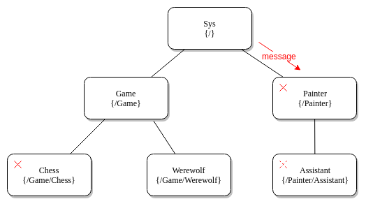

# 模擬 erlang 的 訊息傳遞方式

由於 golang 與 erlang 都是提倡  
以溝通傳遞訊訊息，不要以共用變數傳遞訊息  

但兩個程式語言的原理並不相同  
- erlang 使用 actor 模型  
- golang 使用 csp 模型  

因此嘗試用 golang 模擬 erlang 的部分特定  
此專案只實現兩個 erlang 特性

1. 對特定actor對象，發送訊息
2. 當父級actor結束時，子級actor也會一起結束

可用demo1.go做不同的情況的測試，執行如下圖

**Files:**

1. [package actor](/actor.go)
2. [demo1.go](demo1.go)
3. [demo2.go](../demo2/demo2.go)

