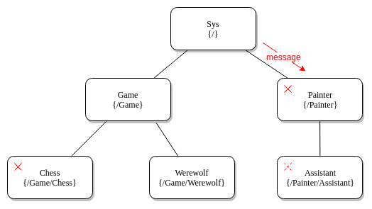
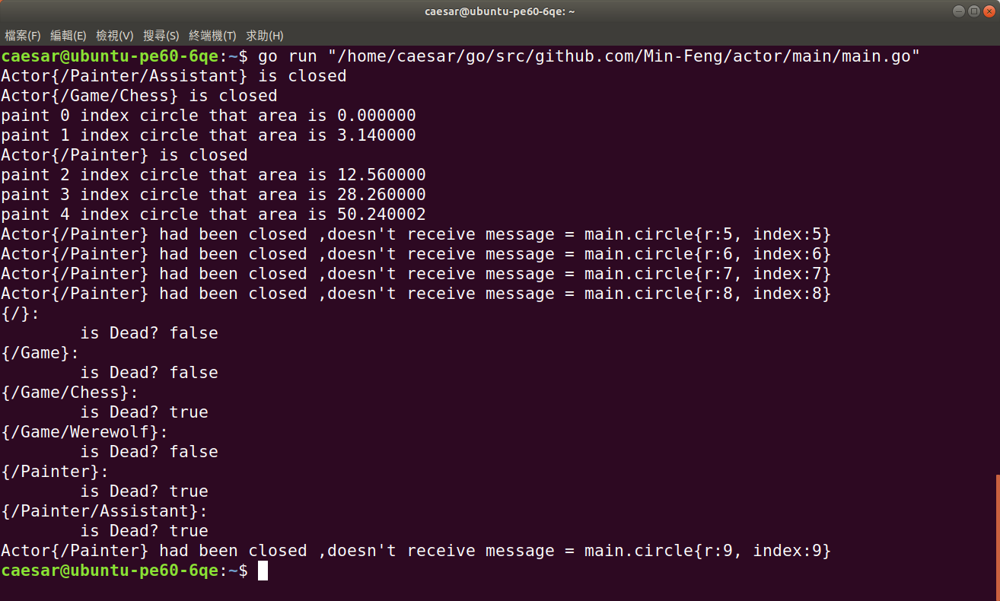

# 模擬 erlang 的 訊息傳遞方式

實現兩個特性

1. 對特定actor對象，發送訊息
2. 當父級actor結束時，子級actor也會一起結束

可用demo1.go做不同的情況的測試，執行如下圖

**Files:**

1. [demo1.go](demo1.go)
2. [demo2.go](../demo2/demo2.go)
3. [package actor](../actor.go)

